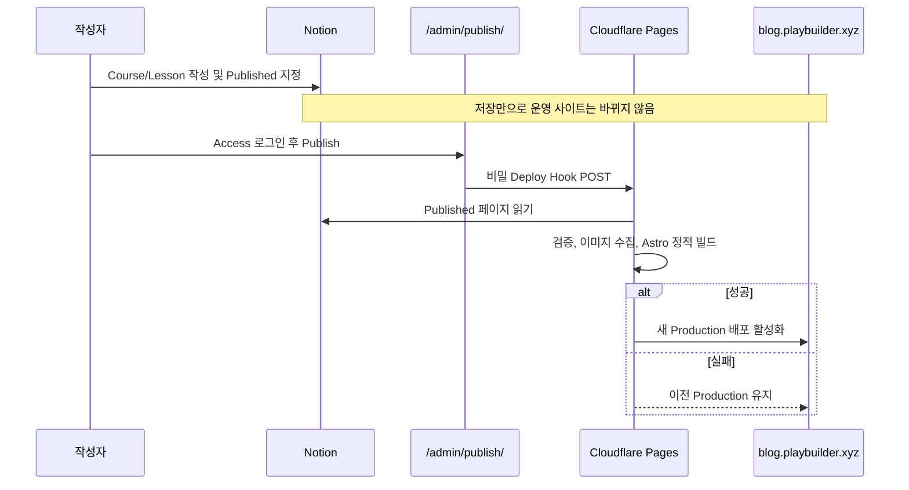

# Notion 강의 자료와 Cloudflare 게시 운영 가이드

## 목차

- [1. 최종 동작](#1-최종-동작)
- [2. Notion 데이터베이스 만들기](#2-notion-데이터베이스-만들기)
- [3. Notion API 연결](#3-notion-api-연결)
- [4. 로컬 검증](#4-로컬-검증)
- [5. Cloudflare Pages 설정](#5-cloudflare-pages-설정)
- [6. Admin 접근 통제](#6-admin-접근-통제)
- [7. 최초 배포와 자동 배포 차단](#7-최초-배포와-자동-배포-차단)
- [8. 평상시 게시 절차](#8-평상시-게시-절차)
- [9. 검증과 장애 처리](#9-검증과-장애-처리)
- [10. 롤백과 비밀값 회전](#10-롤백과-비밀값-회전)

## 1. 최종 동작

**핵심 요약:** 개인 Notion workspace 안에 Courses와 Lessons 데이터베이스를 둔다. 각 데이터베이스 행은 일반 표의 한 줄인 동시에 본문을 작성할 수 있는 Notion 페이지다. Lesson 페이지 본문이 실제 강의·실습 HTML로 변환된다.



이 그림에서 봐야 할 핵심은 Notion의 `Published`가 “다음 빌드에 포함”이라는 뜻이며, 실제 공개에는 Admin Publish와 성공한 Pages 빌드가 추가로 필요하다는 점이다.

Notion의 `Share → Publish` 또는 `Publish to web`은 사용하지 않는다. 페이지는 웹에 직접 공개하지 않고 Notion connection에만 공유한다.

## 2. Notion 데이터베이스 만들기

**핵심 요약:** `Play Builder Course CMS` 같은 private 상위 페이지 아래에 두 개의 full-page database를 만든다. property 이름과 type은 대소문자까지 정확히 맞춘다.

### 2.1 Courses database

1. Notion private 영역에서 `Play Builder Course CMS` 페이지를 만든다.
2. 하위 페이지에서 `Table - Full page`를 선택하고 이름을 `Courses`로 지정한다.
3. 기본 Name property를 `Title`로 변경한다.
4. 다음 property를 추가한다.

| Property      | Notion type   | 예시                            |
| ------------- | ------------- | ------------------------------- |
| `Title`       | Title         | Ethereum Validator Operations   |
| `Slug`        | Text          | `ethereum-validator-operations` |
| `Description` | Text          | 과정 한 줄 설명                 |
| `Order`       | Number        | `1`                             |
| `Status`      | Status        | Draft, Published, Archived      |
| `Tags`        | Multi-select  | Ethereum, Linux                 |
| `Cover`       | Files & media | 선택 이미지                     |

`Slug`는 소문자 영문·숫자와 `-`만 사용한다. 예: `istio-ambient-lab`. 공백, 한글, 대문자, `_`가 있으면 빌드가 실패한다.

Course 행을 열면 Notion 페이지가 된다. 현재 버전은 Course 페이지의 property를 과정 소개/목차로 사용하고, Course 페이지 본문 자체는 사이트에 렌더링하지 않는다.

### 2.2 Lessons database

1. 같은 상위 페이지 아래에 두 번째 `Table - Full page`를 만들고 이름을 `Lessons`로 지정한다.
2. 기본 Name property를 `Title`로 변경한다.
3. 다음 property를 추가한다.

| Property           | Notion type        | 예시                          |
| ------------------ | ------------------ | ----------------------------- |
| `Title`            | Title              | Install execution client      |
| `Slug`             | Text               | `install-execution-client`    |
| `Course`           | Relation → Courses | Ethereum Validator Operations |
| `Module`           | Select             | Setup                         |
| `ModuleOrder`      | Number             | `1`                           |
| `LessonOrder`      | Number             | `1`                           |
| `Description`      | Text               | 레슨 한 줄 설명               |
| `Status`           | Status             | Draft, Published, Archived    |
| `EstimatedMinutes` | Number             | `30`, 선택 값                 |
| `Tags`             | Multi-select       | Linux, Ethereum               |

각 Lesson 행을 열고 본문에 heading, paragraph, list, code, callout, table, image 등 실제 강의 내용을 작성한다. `Course` relation은 반드시 한 개 Course만 지정한다.

정렬 의미는 다음과 같다.

1. `ModuleOrder`가 작은 모듈부터 표시된다.
2. 같은 모듈에서는 `LessonOrder`가 작은 레슨부터 표시된다.
3. Course와 Lesson이 모두 `Published`여야 공개 빌드에 포함된다.

## 3. Notion API 연결

**핵심 요약:** 개인 workspace의 자동화이므로 OAuth나 공개 링크가 필요 없다. 최소 읽기 권한의 Internal Connection을 만들고 두 database에만 연결한다.

1. [Notion Developer portal](https://www.notion.so/profile/integrations)에서 새 Internal Connection을 만든다.
2. 이름을 `Play Builder Course Publisher`로 지정하고 개인 workspace를 선택한다.
3. Content capability는 읽기만 허용한다. 댓글·사용자·쓰기 기능은 허용하지 않는다.
4. Configuration 화면의 installation access token을 복사한다.
5. token은 채팅, 소스 코드, Git commit에 붙여넣지 않는다.
6. Notion의 `Play Builder Course CMS` 상위 페이지에서 `... → Add connections`를 열고 방금 만든 connection을 추가한다.
7. Courses와 Lessons database를 각각 열어 connection이 보이는지 확인한다. 상위 페이지 공유가 상속되지 않는 구성이라면 두 database에서 각각 `Add connections`를 실행한다.

Notion 공식 문서도 connection 사용 전에 페이지를 수동 공유하고 token을 환경 변수/secret manager에 보관하도록 요구한다: [Authorization](https://developers.notion.com/guides/get-started/authorization).

### Data Source ID 복사

현재 Notion API에서는 database ID와 data source ID가 별개다.

1. Courses database 우측 상단 설정을 연다.
2. `Manage data sources`를 연다.
3. Courses data source 메뉴에서 `Copy data source ID`를 선택한다.
4. Lessons도 같은 방법으로 복사한다.
5. 일반 브라우저 URL 전체나 database ID를 넣지 않는다.

코드는 공식 `2026-03-11` API version과 `/v1/data_sources/{id}/query`를 사용한다. 본문은 공식 [Retrieve a page as Markdown](https://developers.notion.com/reference/retrieve-page-markdown) endpoint로 읽는다.

## 4. 로컬 검증

**핵심 요약:** 실제 token 없이 UI와 변환 경로를 먼저 검증한다. 실제 Notion 검증이 필요할 때만 `.env`를 만들며 이 파일은 Git에서 제외된다.

### Fixture 빌드

```bash
pnpm install
pnpm build:fixture
pnpm test
```

정상 결과:

- `Notion sync complete: 1 courses, 2 lessons`
- `dist/courses/ethereum-validator-operations/` 생성
- 모든 Vitest 테스트 통과

### 실제 Notion으로 로컬 빌드

`.env.example`을 참고하여 커밋되지 않는 `.env`를 만든다.

```dotenv
NOTION_SYNC_ENABLED=true
NOTION_TOKEN=<installation-access-token>
NOTION_COURSES_DATA_SOURCE_ID=<courses-data-source-id>
NOTION_LESSONS_DATA_SOURCE_ID=<lessons-data-source-id>
```

```bash
set -a
source .env
set +a
pnpm build
```

정상 결과는 Published Course/Lesson 개수와 제외 개수가 출력되고 `dist/courses/`가 생성되는 것이다. `401`은 token, `404`는 잘못된 data source ID 또는 connection 공유 누락을 먼저 확인한다.

## 5. Cloudflare Pages 설정

**핵심 요약:** Notion token과 Deploy Hook은 Secret으로, ID와 Access 설정은 Variable로 저장한다. Preview와 Production 값은 의도적으로 분리한다.

Cloudflare Dashboard에서 `Workers & Pages → play-builder-blog → Settings`로 이동한다.

### 5.1 Build 설정

| 항목                   | 값                        |
| ---------------------- | ------------------------- |
| Production branch      | `main`                    |
| Build command          | `pnpm build`              |
| Build output directory | `dist`                    |
| Node.js                | `24` 권장, 최소 `22.12.0` |

### 5.2 Production variables/secrets

`Settings → Variables and Secrets`에서 Production 범위에 다음 값을 만든다. UI 명칭이 바뀐 경우 Build와 Functions 양쪽에서 사용할 수 있는 project environment variable/secret 화면을 사용한다.

| 이름                               | 종류        | 값                            |
| ---------------------------------- | ----------- | ----------------------------- |
| `NOTION_SYNC_ENABLED`              | Variable    | `true`                        |
| `NOTION_COURSES_DATA_SOURCE_ID`    | Secret 권장 | Courses data source ID        |
| `NOTION_LESSONS_DATA_SOURCE_ID`    | Secret 권장 | Lessons data source ID        |
| `NOTION_TOKEN`                     | Secret 필수 | Notion installation token     |
| `CF_ACCESS_TEAM_DOMAIN`            | Variable    | `팀이름.cloudflareaccess.com` |
| `CF_ACCESS_AUD`                    | Variable    | Access application AUD        |
| `CLOUDFLARE_PAGES_DEPLOY_HOOK_URL` | Secret 필수 | Production Deploy Hook URL    |

Preview에서 실제 Notion content를 노출하지 않으려면 Preview의 `NOTION_SYNC_ENABLED`는 `false`로 둔다.

### 5.3 Deploy Hook 만들기

1. Pages project에서 `Settings → Builds → Add deploy hook`을 선택한다.
2. 이름을 `notion-course-manual-publish`로 지정한다.
3. branch는 `main`을 선택한다.
4. 생성된 URL을 복사해 `CLOUDFLARE_PAGES_DEPLOY_HOOK_URL` Secret으로 저장한다.
5. URL을 문서, browser JavaScript, GitHub secret이 아닌 공개 파일에 넣지 않는다.

Deploy Hook은 인증 header가 없는 bearer URL과 같으므로 URL을 아는 사람은 빌드를 시작할 수 있다. 이 구현은 URL을 Pages Function 내부에서만 읽는다. 공식 절차: [Cloudflare Pages Deploy Hooks](https://developers.cloudflare.com/pages/configuration/deploy-hooks/).

## 6. Admin 접근 통제

**핵심 요약:** `/admin`은 Cloudflare Access의 정확한 관리자 email 정책과 Pages Function의 JWT 재검증을 모두 통과해야 한다. IP 기반 제한은 사용하지 않으므로 관리자는 네트워크 변경과 관계없이 로그인할 수 있다.

### 6.1 Self-hosted application

1. Cloudflare Zero Trust Dashboard에서 `Access controls → Applications`로 이동한다.
2. `Add an application → Self-hosted`를 선택한다.
3. application 이름을 `Play Builder Publish Console`로 지정한다.
4. public hostname에 `blog.playbuilder.xyz/admin`을 추가한다.
5. 같은 application에 `blog.playbuilder.xyz/admin/*`도 추가한다. UI에서 여러 hostname/path를 받을 수 없다면 같은 policy를 쓰는 application 두 개를 만든다.

`/admin/*` wildcard는 parent `/admin` 자체를 보호하지 않으므로 두 path가 필요하다. 공식 설명: [Access application paths](https://developers.cloudflare.com/cloudflare-one/access-controls/policies/app-paths/).

두 application으로 나누어 AUD가 두 개라면 `CF_ACCESS_AUD`에 comma-separated 두 AUD를 넣어야 한다. 가능하면 한 application의 두 public hostname/path로 구성해 AUD를 하나로 유지한다.

### 6.2 Allow policy

정책은 다음과 같이 구성한다.

| 동작    | Selector | 값                         |
| ------- | -------- | -------------------------- |
| Include | Emails   | 본인의 정확한 관리자 email |

Access 정책에는 관리자 email만 Include하고 IP selector와 Bypass/Service Auth recovery policy를 만들지 않는다. 이 구성은 네트워크 위치를 추가 인증 요소로 사용하지 않으므로 관리자 email과 IdP 계정을 강하게 보호해야 한다. 기존 Pages 변수 `ADMIN_ALLOWED_IPS`는 더 이상 사용하지 않으며 삭제할 수 있다.

### 6.3 AUD와 team domain

1. application 설정에서 `Application Audience (AUD) Tag`를 복사한다.
2. `CF_ACCESS_AUD`에 저장한다.
3. Zero Trust team domain의 hostname만 `CF_ACCESS_TEAM_DOMAIN`에 저장한다. 예: `play-builder.cloudflareaccess.com`.

Pages middleware는 다음 조건을 모두 검증한다.

- hostname이 정확히 `blog.playbuilder.xyz`
- POST Origin이 `https://blog.playbuilder.xyz`
- `Cf-Access-Jwt-Assertion`의 서명, issuer, audience, expiry
- JWT에 `email`, `sub` claim 존재

따라서 `play-builder.pages.dev/admin/...` 직접 접근은 403이다. Cloudflare도 origin에서 Access token을 검증해 우회를 차단하도록 권장한다: [Validate Access JWTs](https://developers.cloudflare.com/cloudflare-one/access-controls/applications/http-apps/authorization-cookie/validating-json/).

## 7. 최초 배포와 자동 배포 차단

**핵심 요약:** 현재 프로젝트는 Git push마다 자동 Production 배포가 켜져 있다. 이것을 그대로 두면 Admin Publish를 누르지 않아도 다음 코드 push가 최신 Notion Published 내용을 공개하므로 수동 게시 요구를 위반한다.

최초 한 번은 다음 순서를 지킨다.

1. Notion/Pages/Access 변수와 Secret을 모두 설정한다.
2. 민감하거나 미완성인 Lesson은 `Draft`로 둔다.
3. 사용자가 기능 branch를 `main`에 push한다.
4. 기존 Git integration의 최초 자동 빌드가 성공하는지 확인한다.
5. `https://blog.playbuilder.xyz/courses/`와 Admin 403/login 동작을 확인한다.
6. Pages project에서 `Settings → Builds → Branch control`을 연다.
7. `Enable automatic production branch deployments`를 끄고 저장한다.
8. 필요하면 Preview branch deployment도 `None`으로 설정한다.

Cloudflare 공식 문서도 production branch 자동 배포를 끌 수 있다고 명시한다: [Branch deployment controls](https://developers.cloudflare.com/pages/configuration/branch-build-controls/).

이후 Git push는 저장소만 갱신하고 Production을 바꾸지 않는다. 코드와 Notion 변경 모두 준비된 시점에 Admin Publish가 main의 최신 commit을 빌드한다.

## 8. 평상시 게시 절차

**핵심 요약:** Notion에서 Public web 전환이나 URL 입력 단계는 없다. Database page를 작성하고 Status를 바꾼 뒤 보호된 Admin 화면에서 전체 Published snapshot을 배포한다.

1. Notion Lessons database에서 새 행을 만든다.
2. `Title`, `Slug`, `Course`, Module/order, Description을 입력한다.
3. 행을 페이지로 열어 실습 본문을 작성한다.
4. 작업 중에는 `Status=Draft`를 유지한다.
5. Course가 `Published`인지 확인한다.
6. 공개할 모든 Lesson을 검토하고 `Status=Published`로 바꾼다.
7. 브라우저에서 `https://blog.playbuilder.xyz/admin/publish/`를 연다.
8. Cloudflare Access에서 등록된 관리자 email로 로그인한다.
9. `Publish to Production`을 누르고 확인 dialog를 승인한다.
10. `Deployment requested`가 표시되면 Cloudflare Pages Deployments를 연다.
11. build status가 Success가 될 때까지 확인한다.
12. 실제 Course/Lesson URL, 이미지, code block, 이전/다음 탐색, 검색을 확인한다.

Publish 버튼 성공은 배포 완료가 아니라 Deploy Hook이 요청을 받았다는 뜻이다. 최종 판단은 Pages Deployment의 Success와 운영 URL 실측이다.

## 9. 검증과 장애 처리

| 증상                       | 먼저 확인할 항목                                                        |
| -------------------------- | ----------------------------------------------------------------------- |
| Admin login 화면도 안 나옴 | DNS proxy, Access application path, email Allow policy                  |
| Access 통과 후 403         | Pages custom hostname, Access assertion, AUD/team domain                |
| Publish 502                | Deploy Hook 삭제/회전 여부, runtime Secret, Pages incident              |
| Build 401                  | `NOTION_TOKEN` 값과 token 회전 여부                                     |
| Build 404                  | data source ID인지, `Add connections`가 되었는지                        |
| property validation 실패   | property 이름/type, slug, relation, order, Status                       |
| Markdown incomplete 오류   | 권한 없는 child page, 미지원 block, 지나치게 큰 page 여부               |
| 이미지 실패                | HTTPS URL, 10 MiB 제한, image Content-Type                              |
| 새 내용이 안 보임          | Course와 Lesson 모두 Published인지, 새 deployment가 Production인지      |
| 코드 push 후 배포 안 됨    | 정상 동작이다. 자동 Production build를 끈 상태에서는 Admin Publish 필요 |

빌드 실패 시 Cloudflare Pages는 이전 성공 Production을 계속 서비스한다. Notion에서 즉시 Status를 Draft로 되돌릴 필요는 없지만, 원인을 수정한 뒤 다시 Publish해야 한다.

## 10. 롤백과 비밀값 회전

### 이전 배포로 롤백

1. Pages project의 `Deployments`를 연다.
2. 마지막 정상 Production deployment를 선택한다.
3. Dashboard가 제공하는 rollback/promote 동작으로 이전 배포를 Production으로 전환한다.
4. Course URL과 canonical을 다시 확인한다.

### Notion token 회전

1. Notion Developer portal에서 connection token을 재발급한다.
2. Pages `NOTION_TOKEN` Secret을 교체한다.
3. 이전 token을 폐기한다.
4. Admin Publish로 새 빌드를 실행한다.

### Deploy Hook 회전

1. 기존 Deploy Hook을 삭제한다.
2. main branch용 새 hook을 만든다.
3. `CLOUDFLARE_PAGES_DEPLOY_HOOK_URL` Secret을 교체한다.
4. Admin Publish로 한 번 검증한다.

Secret 값은 로그나 지원 요청에 복사하지 않는다. 오류 보고에는 status code, operation, resource ID만 사용한다.
