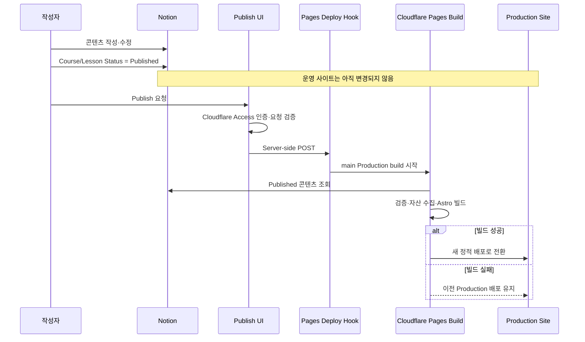

# Notion 강의 자료와 Play Builder 블로그 통합 설계

## 목차

- [1. 목표와 최종 결과](#1-목표와-최종-결과)
- [2. 현재 상태와 전제](#2-현재-상태와-전제)
- [3. 선택한 접근 방식](#3-선택한-접근-방식)
- [4. 정보 구조와 URL](#4-정보-구조와-url)
- [5. Notion 콘텐츠 모델](#5-notion-콘텐츠-모델)
- [6. 구성 요소](#6-구성-요소)
- [7. 작성·게시·배포 흐름](#7-작성게시배포-흐름)
- [8. 콘텐츠 변환 규칙](#8-콘텐츠-변환-규칙)
- [9. UI와 탐색 구조](#9-ui와-탐색-구조)
- [10. 보안 설계](#10-보안-설계)
- [11. 오류 처리와 롤백](#11-오류-처리와-롤백)
- [12. 관측성과 운영](#12-관측성과-운영)
- [13. TDD와 검증 전략](#13-tdd와-검증-전략)
- [14. 단계별 전달 범위](#14-단계별-전달-범위)
- [15. 비목표와 후속 확장](#15-비목표와-후속-확장)
- [16. 완료 기준](#16-완료-기준)

## 1. 목표와 최종 결과

**핵심 요약:** 기존 Astro 기술 블로그를 유지하면서 Notion에서 관리하는 공개 강의 자료를 같은 사이트에 통합한다. Notion의 편집 내용은 자동 공개하지 않고, 관리자가 명시적으로 `Publish`를 실행했을 때만 Cloudflare Pages Production 배포에 반영한다.

최종 사용자 관점의 결과는 다음과 같다.

- `playbuilder.xyz`는 프로필·경력 홈페이지로 유지한다.
- `blog.playbuilder.xyz`는 기술 글과 강의 자료를 제공하는 통합 지식 사이트가 된다.
- 기존 기술 글 URL `/posts/*`는 변경하지 않는다.
- 강의 자료는 `/courses/*`에서 과정, 모듈, 레슨 구조로 탐색한다.
- 작성자는 Notion에서 계속 내용을 작성·수정한다.
- Notion 편집만으로 운영 사이트가 변경되지 않는다.
- 관리자가 보호된 게시 기능을 실행하고 Production 빌드가 성공한 경우에만 변경 사항이 공개된다.
- Oopy와 같은 별도 Notion 퍼블리싱 SaaS를 사용하지 않는다.

## 2. 현재 상태와 전제

**핵심 요약:** 현재 블로그는 Astro 6 기반 정적 사이트이며 GitHub `main` 브랜치가 Cloudflare Pages 프로젝트에 자동 배포된다. `blog.playbuilder.xyz`와 `play-builder.pages.dev`는 같은 Production 배포를 제공하지만 canonical 설정은 아직 Pages 기본 도메인을 사용한다.

현재 저장소와 운영 환경에서 확인된 사실은 다음과 같다.

- 프레임워크: Astro `^6.4.2`
- 런타임 요구사항: Node.js `>=22.12.0`
- 패키지 관리자: pnpm
- 검색: Pagefind
- 배포: Cloudflare Pages Git integration
- Production branch: `main`
- Production 도메인:
  - `https://blog.playbuilder.xyz`
  - `https://play-builder.pages.dev`
- 현재 canonical site URL: `https://play-builder.pages.dev/`
- 현재 공개 기술 글: `src/content/posts/*.md`
- 현재 자동화된 테스트 러너: 없음

이 설계는 다음 전제를 고정한다.

- 첫 전달 범위의 강의 자료는 로그인 없이 읽을 수 있는 공개 콘텐츠다.
- Notion Integration과 공유된 Course/Lesson 데이터만 읽는다.
- Notion API 토큰과 Cloudflare Deploy Hook URL은 저장소에 커밋하지 않는다.
- GitHub 원격 푸시는 사용자가 직접 수행한다.
- 관리자가 `Publish`를 요청하는 시점은 해당 배치의 모든 공개 변경을 릴리스할 준비가 된 시점이다.

## 3. 선택한 접근 방식

**핵심 요약:** Notion을 Headless CMS로 사용하고, Cloudflare Pages 빌드 시점에 공개 콘텐츠를 가져와 정적 HTML로 생성한다. Runtime reverse proxy나 제3자 호스팅 계층을 두지 않으므로 기존 Astro UI, 검색, Sitemap과 배포 롤백을 그대로 활용할 수 있다.

### 3.1 채택: Build-time Notion sync

Cloudflare Pages 빌드는 Notion API에서 `Published` 콘텐츠를 읽어 정규화된 중간 결과와 정적 자산을 생성한다. Astro는 이 결과로 Course와 Lesson 정적 페이지를 만든다.

장점은 다음과 같다.

- 방문 요청마다 Notion API를 호출하지 않는다.
- Notion 장애나 API 지연이 이미 배포된 사이트에 영향을 주지 않는다.
- Cloudflare CDN에서 완전한 정적 페이지로 제공된다.
- 기존 Astro 레이아웃과 접근성, Pagefind, Sitemap을 재사용한다.
- Cloudflare Pages의 이전 Production 배포로 롤백할 수 있다.

### 3.2 제외: Notion reverse proxy

Cloudflare Worker가 Notion의 HTML을 실시간으로 프록시·재작성하는 방식은 제외한다.

- Notion 내부 HTML과 스크립트 변경에 취약하다.
- 기존 Astro 디자인과 완전하게 통합하기 어렵다.
- Content Security Policy, 쿠키, 이미지 URL과 SEO 처리 복잡도가 높다.
- 운영 요청이 Notion 가용성과 응답 속도에 의존한다.

### 3.3 제외: Notion 변경마다 Git 자동 커밋

Notion 콘텐츠를 Markdown으로 변환해 Git에 자동 커밋하는 방식도 첫 전달 범위에서 제외한다.

- 콘텐츠 이력은 명확하지만 GitHub 쓰기 토큰과 봇 권한이 추가된다.
- 콘텐츠 변경마다 저장소 커밋이 발생한다.
- 사용자가 관리하는 원격 푸시 경계와 별도의 자동 Git 쓰기 경로가 생긴다.

## 4. 정보 구조와 URL

**핵심 요약:** 기술 글과 강의 자료는 같은 브랜드와 레이아웃을 공유하지만 URL과 콘텐츠 유형은 분리한다. 기존 기술 글의 주소는 보존하고 강의 전용 `/courses` 트리를 추가한다.

| URL | 역할 |
|---|---|
| `playbuilder.xyz` | 프로필·경력 홈페이지 |
| `blog.playbuilder.xyz/` | 통합 콘텐츠 홈 |
| `/posts/` | 기존 기술 글 목록 |
| `/posts/{slug}/` | 기존 기술 글 상세 |
| `/courses/` | 공개 강의 목록 |
| `/courses/{courseSlug}/` | 과정 소개와 커리큘럼 |
| `/courses/{courseSlug}/{lessonSlug}/` | 개별 강의·실습 자료 |
| `/admin/publish/` | 관리자 게시 화면 |
| `/admin/api/publish` | 보호된 게시 요청 endpoint |

`edu-resources` 대신 `courses`를 사용한다. URL이 짧고 과정·모듈·레슨의 계층을 자연스럽게 설명하기 때문이다.

기존 `/posts/*`를 `/tech/*`로 이동하지 않는다. 이전 링크, 검색엔진 색인, 공유 URL을 보존하고 탐색 메뉴의 표시 이름만 `Tech Posts`로 바꾼다.

## 5. Notion 콘텐츠 모델

**핵심 요약:** Course와 Lesson을 두 개의 Notion Data Source로 구분한다. Course는 과정 수준 메타데이터를, Lesson은 실제 본문과 모듈·순서·공개 상태를 관리한다.

### 5.1 Courses Data Source

| 속성 | 유형 | 규칙 |
|---|---|---|
| `Title` | Title | 과정 표시 이름 |
| `Slug` | Rich text | 사이트 전체에서 고유한 소문자 kebab-case |
| `Description` | Rich text | 목록·SEO 설명 |
| `Order` | Number | 과정 목록 정렬 순서 |
| `Status` | Status | `Draft`, `Published`, `Archived` |
| `Tags` | Multi-select | 기술 영역 분류 |
| `Cover` | Files | 과정 카드 이미지, 선택 항목 |

### 5.2 Lessons Data Source

| 속성 | 유형 | 규칙 |
|---|---|---|
| `Title` | Title | 레슨 표시 이름 |
| `Slug` | Rich text | 해당 Course 안에서 고유한 kebab-case |
| `Course` | Relation | Courses Data Source의 한 항목 |
| `Module` | Select | 모듈 표시 이름 |
| `ModuleOrder` | Number | 모듈 정렬 순서 |
| `LessonOrder` | Number | 모듈 안의 레슨 정렬 순서 |
| `Description` | Rich text | 레슨 요약 |
| `Status` | Status | `Draft`, `Published`, `Archived` |
| `EstimatedMinutes` | Number | 예상 학습 시간, 선택 항목 |
| `Tags` | Multi-select | 검색·필터용 분류 |

Course와 Lesson이 모두 `Published`인 경우에만 운영 빌드 대상이 된다. `Draft`와 `Archived`는 공개 빌드에서 제외한다.

현재 일반 Notion 페이지로 작성된 자료는 본문을 새로 작성하지 않고 해당 Data Source의 페이지로 이동하거나 연결한다. 마이그레이션 중 원본 페이지는 제거하지 않으며, 새 사이트 검증 후 사용자가 직접 정리한다.

## 6. 구성 요소

**핵심 요약:** Notion 접근, 콘텐츠 정규화, 정적 페이지 생성, 게시 요청을 서로 분리한다. 각 단위는 fixture와 dependency injection으로 독립 검증할 수 있어야 한다.

### 6.1 Notion API client

역할:

- Courses와 Lessons Data Source를 pagination 처리하여 조회한다.
- 페이지 본문을 공식 Markdown API 또는 Block API로 조회한다.
- API 오류에 page ID, operation, status를 포함한 정규화 오류를 반환한다.

환경 변수:

- `NOTION_TOKEN`
- `NOTION_COURSES_DATA_SOURCE_ID`
- `NOTION_LESSONS_DATA_SOURCE_ID`

### 6.2 Content normalizer

역할:

- Notion 속성을 내부 `Course`와 `Lesson` 모델로 변환한다.
- `Published` 필터와 정렬 규칙을 적용한다.
- Slug, Relation, 순서와 필수 속성을 검증한다.
- 지원하지 않는 블록을 발견하면 정확한 page ID와 block type으로 빌드를 중단한다.

이 계층은 네트워크를 직접 호출하지 않는 순수 함수 중심으로 구성한다.

### 6.3 Asset ingestor

역할:

- 만료되는 Notion file URL의 이미지를 빌드 중 내려받는다.
- Course, page, block ID와 콘텐츠 hash를 조합한 안정적인 경로를 생성한다.
- HTTPS가 아닌 URL과 loopback/private network 대상 URL을 거부한다.
- 허용된 크기와 Content-Type을 벗어난 자산에서 빌드를 실패시킨다.
- 결과를 전용 생성 디렉터리에 저장한다.

Notion signed URL을 생성된 HTML에 직접 남기지 않는다. 해당 URL은 만료되므로 배포 후 이미지가 깨질 수 있기 때문이다.

### 6.4 Sync command

역할:

- Notion API client, normalizer, asset ingestor를 조합한다.
- 생성 결과를 전용 디렉터리에만 쓴다.
- 성공 시 Course/Lesson 수와 제외된 Draft/Archived 수를 출력한다.
- 오류 시 non-zero exit code로 Cloudflare Pages 빌드를 중단한다.

생성 디렉터리는 사용자 작성 콘텐츠와 분리하고 Git에서 제외한다. 정리 작업은 해당 전용 경로만 대상으로 하며 광범위한 경로나 glob을 삭제하지 않는다.

### 6.5 Astro course pages

역할:

- Course 목록, 과정 상세, Lesson 상세의 정적 경로를 생성한다.
- 공통 Layout, Header, Footer와 theme을 재사용한다.
- Lesson 본문에 Course·Module 탐색과 breadcrumb를 제공한다.
- Pagefind가 콘텐츠 유형과 Course를 필터링할 수 있는 metadata를 추가한다.

### 6.6 Publish UI와 endpoint

역할:

- `/admin/publish/`에서 명시적인 Production 게시 요청을 받는다.
- `/admin/api/publish`가 Cloudflare Deploy Hook에 server-side POST를 보낸다.
- 성공 응답은 배포 완료가 아니라 `deployment requested`로 표시한다.
- 최종 성공 여부는 Cloudflare Pages Deployment 결과로 판단한다.

`CLOUDFLARE_PAGES_DEPLOY_HOOK_URL`은 endpoint의 runtime secret으로만 제공한다.

## 7. 작성·게시·배포 흐름

**핵심 요약:** 편집과 공개를 분리한다. Notion 변경 Webhook은 사용하지 않으며, 관리자의 게시 요청만 Production 빌드를 시작한다.



이 그림에서 봐야 할 핵심은 Notion 저장과 Production 공개 사이에 관리자의 `Publish`와 성공한 Pages 빌드가 모두 필요하다는 점이다.

이미 `Published`인 Lesson을 수정해도 Publish를 다시 실행하기 전에는 운영 사이트가 바뀌지 않는다. Publish는 특정 한 페이지가 아니라 그 시점의 모든 `Published` 콘텐츠를 하나의 릴리스 배치로 만든다.

## 8. 콘텐츠 변환 규칙

**핵심 요약:** 공식 Notion Markdown API를 우선 사용하되, 실제 강의 자료의 블록 호환성 검증을 통과해야 한다. 변환 손실을 조용히 무시하지 않고 명시적으로 실패시킨다.

초기 호환성 검증 대상은 다음과 같다.

- Heading과 paragraph
- Bulleted, numbered, to-do list
- Code block과 language
- Callout
- Quote와 divider
- Toggle
- Table
- Image와 caption
- Bookmark와 external link
- Child page
- Table of contents

변환 규칙은 다음과 같다.

- 제목 계층은 원본 순서를 보존한다.
- 코드 블록 language가 유효하면 syntax highlighting에 전달한다.
- Callout은 기존 블로그 typography와 색상 체계로 렌더링한다.
- Toggle은 접근 가능한 `details`와 `summary`로 변환한다.
- 표는 작은 화면에서 전용 responsive wrapper 안에서 가로 스크롤을 허용한다.
- 외부 링크는 안전한 `rel` 속성을 추가한다.
- 임의 HTML과 script는 허용하지 않는다.
- 지원되지 않는 블록은 누락시키지 않고 빌드 오류로 보고한다.

## 9. UI와 탐색 구조

**핵심 요약:** 상단 탐색은 기술 글과 강의 자료를 같은 수준에서 구분한다. 강의 상세는 긴 실습 문서를 따라가기 쉽도록 Course/Module/Lesson 탐색을 제공한다.

### 9.1 상단 탐색

```text
Home | Tech Posts | Courses | About | Search
```

- `Tech Posts`는 기존 `/posts/`로 연결한다.
- `Courses`는 `/courses/`로 연결한다.
- `Tags`와 `Archives`는 Tech Posts 화면과 Footer에서 접근하게 하여 상단 폭을 줄인다.
- 탭처럼 보이는 활성 상태를 제공하지만 실제 `<a>`와 독립 URL로 구현한다.

### 9.2 통합 홈

- 사이트 목적과 Tech/Courses 진입 버튼
- 최신 Tech Posts
- 공개 Course
- 프로필 홈페이지 `playbuilder.xyz` 링크

### 9.3 Course 목록

- Course title과 description
- Tags
- Module, Lesson 수
- 마지막 공개 빌드에 포함된 업데이트 날짜

### 9.4 Course 상세와 Lesson

- Course 설명과 전체 커리큘럼
- Module별 Lesson 순서
- 현재 Lesson 강조
- breadcrumb
- 예상 학습 시간
- 이전/다음 Lesson 탐색
- 본문 Table of Contents

### 9.5 검색

Pagefind는 Tech Post와 Course/Lesson을 모두 색인한다. 검색 결과는 `contentType`과 `course` metadata를 포함하여 사용자가 기술 글과 강의 자료를 구분할 수 있게 한다.

## 10. 보안 설계

**핵심 요약:** 읽기용 Notion token과 인증 없는 Deploy Hook URL을 모두 secret으로 취급한다. 게시 endpoint는 custom domain의 Cloudflare Access만 신뢰하지 않고 Access JWT를 검증해 Pages 기본 도메인을 통한 우회를 차단한다.

### 10.1 Secret 관리

- `NOTION_TOKEN`은 Cloudflare Pages Production build secret으로 저장한다.
- Data Source ID는 환경 변수로 관리하되 로그에 전체 값을 출력하지 않는다.
- Deploy Hook URL은 runtime secret으로 저장한다.
- `.env`와 `.dev.vars`는 Git에서 제외한다.
- 오류 로그에 Authorization header, token, signed asset query를 출력하지 않는다.

### 10.2 게시 endpoint 보호

- Cloudflare Access로 `blog.playbuilder.xyz/admin/*`를 제한한다.
- endpoint는 `Cf-Access-Jwt-Assertion`의 signature, issuer, audience, expiry를 검증한다.
- Access assertion이 없는 `play-builder.pages.dev/admin/api/publish` 요청은 거부한다.
- `POST`만 허용하고 다른 method는 `405`를 반환한다.
- 요청 `Origin`은 `https://blog.playbuilder.xyz`만 허용한다.
- Deploy Hook URL을 client response나 HTML에 포함하지 않는다.

### 10.3 Notion 권한

- Integration에는 콘텐츠 읽기에 필요한 최소 capability만 부여한다.
- Courses와 Lessons Data Source만 Integration과 공유한다.
- 전체 workspace 접근 권한을 부여하지 않는다.

## 11. 오류 처리와 롤백

**핵심 요약:** 콘텐츠 오류와 외부 API 오류는 불완전한 사이트를 배포하는 대신 빌드를 실패시킨다. Production 전환 전 실패이므로 현재 정상 배포는 계속 제공된다.

빌드를 중단하는 조건은 다음과 같다.

- Notion API authentication 또는 permission 실패
- pagination 중 일부 page 조회 실패
- 필수 속성 누락
- Course 또는 Lesson slug 중복
- Published Lesson의 Course relation 누락
- Published Lesson이 Draft/Archived Course를 참조
- Module/Lesson 정렬 값 누락 또는 충돌
- 지원하지 않는 Notion block type
- Notion asset 다운로드 또는 검증 실패
- Astro check/build 실패
- Pagefind indexing 실패

롤백 순서는 다음과 같다.

1. Cloudflare Pages에서 마지막 정상 Production deployment를 확인한다.
2. 문제가 신규 배포 후 발견된 경우 이전 정상 deployment로 rollback한다.
3. Notion의 문제 항목을 `Draft`로 전환하거나 콘텐츠를 수정한다.
4. Publish를 다시 요청하고 Preview/Production 검증을 반복한다.

Notion 원본 콘텐츠를 자동 삭제하거나 되돌리지 않는다. 생성 디렉터리와 빌드 결과는 재생성 가능한 캐시로 취급한다.

## 12. 관측성과 운영

**핵심 요약:** 게시 요청, 콘텐츠 동기화, 빌드, 운영 페이지 응답을 서로 다른 단계로 관측한다. `deployment requested`를 배포 성공으로 표현하지 않는다.

필수 로그와 지표는 다음과 같다.

- 게시 요청 시각과 인증된 사용자 식별자
- Deploy Hook 요청 성공·실패
- Notion Course/Lesson 조회 수
- Published, Draft, Archived 제외 수
- 다운로드한 asset 수와 전체 크기
- 변환 실패 page ID와 block type
- Cloudflare Pages build status와 commit SHA
- 배포 후 핵심 URL HTTP status

로그에서 콘텐츠 본문, secret, signed URL query와 개인정보는 제외한다.

운영 상태는 다음과 같이 구분한다.

- `PUBLISH_REQUESTED`: Deploy Hook 요청 수락
- `BUILD_RUNNING`: Cloudflare Pages 빌드 진행
- `BUILD_FAILED`: 새 Production 전환 없음
- `PRODUCTION_DEPLOYED`: Production 배포 성공
- `LIVE_VERIFIED`: custom domain의 핵심 페이지를 별도 검증

## 13. TDD와 검증 전략

**핵심 요약:** 모든 동작 변경은 실패하는 테스트를 먼저 만들고 예상한 이유로 실패하는 것을 확인한 뒤 최소 구현을 추가한다. 실제 Notion과 Cloudflare 검증은 fixture 단위 테스트와 별도의 integration/live 검증으로 구분한다.

### 13.1 TDD 규칙

각 기능은 다음 순서로 진행한다.

1. `RED`: 한 가지 동작을 설명하는 실패 테스트 작성
2. 실패가 오타나 환경 오류가 아니라 구현 부재 때문인지 확인
3. `GREEN`: 테스트를 통과하는 최소 구현
4. 관련 테스트 전체 실행
5. `REFACTOR`: 중복과 이름 개선
6. 전체 테스트가 계속 통과하는지 확인

Production 코드를 먼저 작성한 뒤 테스트를 추가하지 않는다.

### 13.2 단위 테스트 범위

- `Published` Course/Lesson 필터
- Course, Module, Lesson 정렬
- Slug 형식과 중복 검출
- Relation과 필수 속성 검증
- Notion property의 내부 모델 변환
- block/Markdown 변환 규칙
- 지원하지 않는 block의 명시적 실패
- asset filename 안정성
- 위험한 asset URL 거부
- publish endpoint method, origin, auth 실패
- 유효한 publish 요청만 Deploy Hook을 한 번 호출

외부 API client는 transport를 주입해 fixture response로 검증한다. 단위 테스트가 mock 호출 횟수만 확인하지 않고 반환된 도메인 결과와 오류를 검증하게 한다.

### 13.3 통합 테스트 범위

- 고정된 Notion fixture로 Course/Lesson 생성
- 생성 결과로 Astro production build
- 예상 Course와 Lesson URL 생성 확인
- Draft와 Archived URL이 생성되지 않는지 확인
- canonical URL이 `blog.playbuilder.xyz`인지 확인
- Sitemap에 Courses가 포함되는지 확인
- 기존 11개 기술 글 URL 보존 확인
- Pagefind가 Tech와 Course 콘텐츠를 모두 색인하는지 확인

### 13.4 외부·운영 검증 범위

Notion credential과 Cloudflare 설정이 준비된 후 다음을 별도로 수행한다.

- read-only Notion API smoke test
- 대표 Course/Lesson Preview build
- 이미지, code, callout, toggle, table 화면 검증
- 관리자 Publish authentication 검증
- 실패 build에서 이전 Production 유지 확인
- `blog.playbuilder.xyz` 핵심 URL과 Sitemap 실측

fixture 테스트 통과를 Notion live integration 또는 Production 배포 완료로 표현하지 않는다.

## 14. 단계별 전달 범위

**핵심 요약:** 위험이 낮은 변환 PoC에서 시작해 콘텐츠 모델, UI, 게시 제어, 운영 전환 순서로 진행한다. 각 단계는 독립적인 RED-GREEN-REFACTOR와 검증 결과를 남긴다.

### 단계 1: 테스트 기반과 콘텐츠 계약

- test runner 추가
- Notion fixture와 test utility 추가
- Course/Lesson 내부 타입과 검증 계약 구현
- 공개 상태와 정렬 규칙 구현

### 단계 2: Notion read-only sync

- Notion API client
- pagination
- Markdown/Block 변환
- asset ingestion
- 생성 디렉터리와 sync command

### 단계 3: Courses UI와 정적 경로

- `/courses/`
- Course 상세
- Lesson 상세와 사이드바
- Header와 통합 Home 변경
- responsive·접근성 검증

### 단계 4: 검색과 SEO

- canonical domain 변경
- Sitemap
- Pagefind metadata
- 기존 Tech Posts 회귀 검증

### 단계 5: 수동 Publish

- 관리자 화면
- Access JWT 검증
- Deploy Hook adapter
- 오류·성공 상태 표현
- Cloudflare Access 설정 절차

### 단계 6: Preview와 Production 검증

- 실제 Notion Data Source 연결
- Cloudflare Preview build
- desktop/mobile human check
- Production publish 준비
- rollback 절차 실측

## 15. 비목표와 후속 확장

**핵심 요약:** 첫 전달은 공개 강의 자료와 수동 Production 게시에 집중한다. 인증형 LMS, 학습 진도, 댓글과 결제는 범위에 포함하지 않는다.

첫 전달 범위에 포함하지 않는 항목은 다음과 같다.

- 학생별 로그인과 권한
- 유료 강의 결제
- 수강 진도와 완료율
- 퀴즈·채점·과제 제출
- 댓글과 토론
- Notion 변경 Webhook 기반 즉시 배포
- 다국어 Course 번역
- Course RSS
- Notion으로의 역방향 편집

후속 단계에서 비공개 강의가 필요하면 Cloudflare Access 정책을 `/courses/private/*`에 적용하거나 별도 학습 포털로 분리한다. 공개 URL에 인증을 나중에 추가하면 수강생 링크 동작이 바뀌므로 별도 설계로 다룬다.

## 16. 완료 기준

**핵심 요약:** 코드가 존재하는 것만으로 완료하지 않는다. fixture, static build, Preview, Production과 live domain은 서로 다른 검증 단계로 보고한다.

구현 완료 조건은 다음과 같다.

- 모든 신규 production 동작에 대응하는 테스트가 먼저 실패한 기록이 있다.
- 단위 테스트 전체가 통과한다.
- lint, format check, Astro check와 production build가 통과한다.
- fixture 기준 Course/Lesson 경로와 비공개 제외 규칙이 검증된다.
- 기존 11개 Tech Post URL이 유지된다.
- canonical, Sitemap과 Pagefind가 요구사항을 충족한다.
- secret이 Git diff와 빌드 로그에 포함되지 않는다.
- Cloudflare Preview에서 대표 Notion 콘텐츠를 화면 검증한다.
- Publish 요청과 Production 성공을 구분해 보고한다.
- Production 배포 후 `blog.playbuilder.xyz`의 핵심 URL을 실측한다.
- 롤백 절차를 실행하거나 안전한 Preview 환경에서 동등한 복구 동작을 검증한다.

사용자가 GitHub 원격 푸시와 최종 Production 게시를 직접 수행할 수 있도록 로컬 커밋, 검증 결과, 필요한 명령과 Cloudflare Dashboard 설정을 인계한다.
